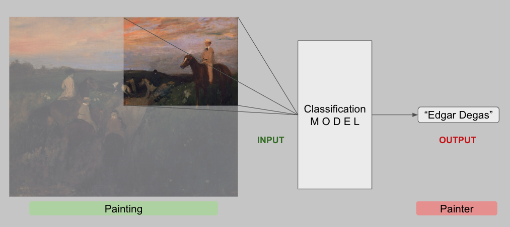

# Artist Classification 
Closed [월간 데이콘 예술 작품 화가 분류 AI 경진대회
](https://dacon.io/competitions/official/236006/overview/description)에 참여하는 Team Project  
디테일 한 내용은 블로그를 참고해주세요.  
[](https://medium.com/@dlstj1506/artist-classification-project-0475f351ce47)

## Prerequisites
* Colab or Kaggle Notebook
* python 3.8.1
* opencv 4.8.0.76
* pytorch 2.1.0+cu121
* albumentation 1.3.1
* scikit-learn 1.2.2
* pandas 1.5.3
* numpy 1.23.5
* matplotlib 3.7.1
* seaborn 0.12.2
* ...
## Description
#### 대회 소개

* 목표 : 예술작품의 일부분(약 1/4)을 통해 화가를 분류하는 AI모델 개발
* Evaluation Metric : Macro F1 Score
* Data
    * Train : 5911 images
    * Test : 12670 images (1/4 size)
    * Class : 50 artists
#### 프로젝트 진행 방식 
각 팀원 별로 파트를 분담하였고, 본인은 Data Set을 담당  
Data Augmentation 기법을 통한 성능을 향상을 목표로 실험을 진행
* Base Environment
    * Tool : Google Colab and Kaggle Notebook
    * GPU : P100 and V100 and T4
* [Baseline](https://github.com/LEEINSEO-0118/Artist_Classification/blob/main/BaseLine/CV_Project_Team_Baseline.ipynb)
    * Dacon에서 제공해주는 Baseline을 기반으로 실험을 진행
    * Backbone : EfficientNet_b0
    * Loss : CrossEntropy
    * Augmentation : Resize, Normalize
    * Optimizer : Adam  
    [Baseline 기반으로 실험한 Notebook](https://github.com/LEEINSEO-0118/Artist_Classification/tree/main/BaseLine_1_Test) 
* [Baseline_2](https://github.com/LEEINSEO-0118/Artist_Classification/blob/main/BaseLine/CV_Project_Baseline_2.ipynb)
    * 기존 Baseline에서 RandomResizedCrop을 적용
    * 나머지 조건은 동일  
    [Baseline_2 기반으로 실험한 Notebook](https://github.com/LEEINSEO-0118/Artist_Classification/tree/main/BaseLine_2_Test)

## Installation
```python
# Clone this Repsoitory
git clone https://github.com/LEEINSEO-0118/Artist_Classification.git

# Install Prerequistes
pip install -r requirements.txt

# Run .ipynb notebook
```